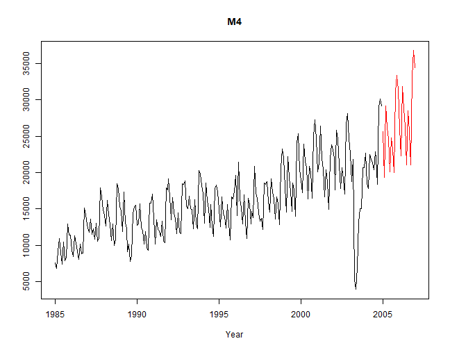

# Tcomp R package
Data from the 2010 Tourism Forecasting competition
[](https://travis-ci.org/ellisp/Tcomp-r-package)

This project provides an R package of convenient access to the data from the tourism forecasting competition described in [Athanasopoulos, Hyndman, Song and Wu (2011)](http://robjhyndman.com/papers/the-tourism-forecasting-competition/). Athanasopoulos et al was originally published in [International Journal of Forecastsing](http://www.forecasters.org/ijf) (2011) 27(3), 822-84.

Currently this package is only available on GitHub:


```r
devtools::install_github("ellisp/Tcomp-r-package/pkg")
```

The original data are from various tourism organisations and academics around the world and are no identifiable to their original metadata.  The copies used for this package came from [Professor Hyndman's webpage](http://robjhyndman.com/papers/the-tourism-forecasting-competition/).  Transformation into the format used in this package is done in the `/prep/` folder of this GitHub project; but there's no need for most users to look into that

Usage is straight-forward.  All 1,311 series are elements in a single list called `tourism`.  `tourism` is an object of class `Mcomp`, and each individual series is an element of class `Mdata` (these classes are borrowed from [Hyndman's `Mcomp` R package](https://cran.r-project.org/package=Mcomp) and come with convenient print, plot, subset, etc methods).


```r
library(Tcomp)
plot(tourism$M4)
```



```r
plot(forecast(tourism$Q12$x))
```


A wrapper function `forecast_comp` is provided that fits four models from the `forecast` package and returns the mean absolute scaled error for user-provided testing periods.

```r
round(forecast_comp(tourism$M4, tests = list(1, 6, 12, 24, 1:12, 1:24), plot = TRUE), 2)
```


```
         1    6   12   24 1-12 1-24
ARIMA 0.01 1.04 2.47 3.40 1.58 2.00
ETS   0.57 1.41 1.06 2.40 0.86 1.04
Theta 0.16 0.13 0.91 2.10 0.61 0.92
Naive 3.23 0.16 1.04 2.38 1.34 1.84
```

This method will also work with the data from the `Mcomp` package:


```r
library(Mcomp)
round(forecast_comp(M3[[2000]], tests = list(1, 3, 6, 1:6), plot = FALSE), 2)
```

```
         1    3    6  1-6
ARIMA 0.19 0.53 0.09 0.29
ETS   0.19 0.95 0.27 0.51
Theta 0.19 0.95 0.28 0.51
Naive 0.93 0.78 0.25 0.68
```

An extended example in `/r/extended-example/reproduce.R` aims to show how this can be used efficiently to reproduce some of the results in Athanasopoulos but currently fails to come up with the same results.

A CRAN release will follow when discrepancies with published results are better understood.  In addition to the problem noted above, currently the package build fails its testing suite which expects the reported series lengths to be the same as those in Athanasopoulos et al.  The training subsets of the data series in this package are shorter than the descriptive statistics in Table 3 of Anthanasopoulos et al.


```r
lengthsm <- sapply(subset(tourism, "monthly"), function(s){length(s$x)})
lengthsq <- sapply(subset(tourism, "quarterly"), function(s){length(s$x)})
lengthsy <- sapply(subset(tourism, "yearly"), function(s){length(s$x)})

# These tests all fail unless the means are truncated (ie rounded down).
# That is, the actual lengths are all slightly longer (on average <1)
# than the reported lengths:
c(mean(lengthsm), 298)
```

```
[1] 274.5792 298.0000
```

```r
c(mean(lengthsq), 99)
```

```
[1] 91.63466 99.00000
```

```r
c(mean(lengthsy), 24)
```

```
[1] 20.4749 24.0000
```

