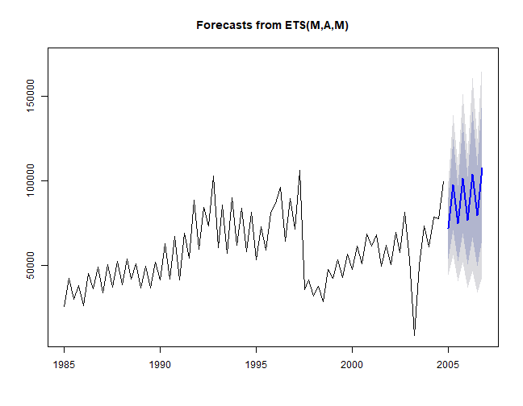

# Tcomp R package
Data from the 2010 Tourism Forecasting competition
[](https://travis-ci.org/ellisp/Tcomp-r-package)
[](http://www.r-pkg.org/pkg/Tcomp)
[](http://www.r-pkg.org/pkg/Tcomp)

This project provides an R package of convenient access to the data from the tourism forecasting competition described in [Athanasopoulos, Hyndman, Song and Wu (2011)](http://robjhyndman.com/papers/the-tourism-forecasting-competition/). Athanasopoulos et al was originally published in [International Journal of Forecastsing](http://www.forecasters.org/ijf) (2011) 27(3), 822-84.

Currently this package is only available on GitHub:


```r
devtools::install_github("ellisp/Tcomp-r-package/pkg")
```

The original data are from various tourism organisations and academics around the world and are no identifiable to their original metadata.  The copies used for this package came from [Professor Hyndman's webpage](http://robjhyndman.com/papers/the-tourism-forecasting-competition/).  Transformation into the format used in this package is done in the `/prep/` folder of this GitHub project; but there's no need for most users to look into that

Usage is straight-forward.  All 1,311 series are elements in a single list called `tourism`.  `tourism` is an object of class `Mcomp`, and each individual series is an element of class `Mdata` (these classes are borrowed from [Hyndman's `Mcomp` R package](https://cran.r-project.org/package=Mcomp) and come with convenient print, plot, subset, etc methods).


```r
library(Tcomp)
plot(tourism$M4)
```


```r
plot(forecast::forecast(tourism$Q12$x))
```



A wrapper function `forecast_comp` is provided that fits four models from the `forecast` package and returns the mean absolute scaled error for user-provided testing periods.

```r
round(forecast_comp(tourism$M4, tests = list(1, 6, 12, 24, 1:12, 1:24), plot = TRUE), 2)
```


```
          1     6    12    24  1-12  1-24
ARIMA  0.12 11.43 17.33 21.86 13.34 15.87
ETS    4.88 15.53  7.45 15.44  8.15  8.68
Theta  1.39  1.39  6.38 13.50  5.41  7.36
Naive 27.86  1.72  7.31 15.31 11.24 14.64
ARIMA  0.01  1.04  2.47  3.40  1.58  2.00
ETS    0.57  1.41  1.06  2.40  0.86  1.04
Theta  0.16  0.13  0.91  2.10  0.61  0.92
Naive  3.23  0.16  1.04  2.38  1.34  1.84
```

This method will also work with the data from the `Mcomp` package:


```r
library(Mcomp)
round(forecast_comp(M3[[2000]], tests = list(1, 3, 6, 1:6), plot = FALSE), 2)
```

```
          1     3    6   1-6
ARIMA  5.14 17.55 2.31  8.75
ETS    5.08 31.45 7.31 15.35
Theta  5.12 31.58 7.50 15.47
Naive 24.53 25.88 6.69 19.81
ARIMA  0.19  0.53 0.09  0.29
ETS    0.19  0.95 0.27  0.51
Theta  0.19  0.95 0.28  0.51
Naive  0.93  0.78 0.25  0.68
```

An extended example in `/r/extended-example/reproduce.R` aims to show how this can be used efficiently to reproduce some of the results in Athanasopoulos but currently fails to come up with the same results.

